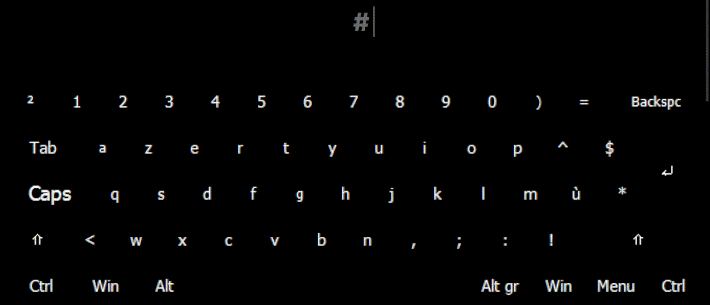

# Arabiyy Keyboard

This tool allows our Muslim brothers and sisters to type any Arabic word with dynamic tashkeel, all of that from the comfort of the Latin keyboard already built into their device and most of the world's devices.

## Table of Contents
- [Introduction](#introduction)
    - [Motivations and Reasons](#motivations-and-reasons)
- [Supported Platforms](#supported-platforms)
- [Download/Install](#download-install)
- [Usage](#usage)
- [Development](#development)
    - [Improvements](#improvements)
    - [Copyright](#copyright)
    - [Who this Tool Will Help](#this-tool-will-help)
        - [Useful Links](#useful-links)
- [Like the Project?](#like-the-project)

## Motivations and Reasons
The `Arabiyy` keyboard was created to facilitate the typing of Arabic text with dynamic tashkeel (diacritics) using the Latin keyboard. This is particularly useful for Islamic science students, subtitle makers, and anyone who needs to type Arabic text accurately and efficiently.

# Supported Platforms
- [x] Windows
- [x] macOS
- [x] Linux
- [ ] Web
- [ ] Android
- [ ] iOS

---
- Support for other platforms like Web, Android, and iOS is planned for the future, in shaa'a Allah.
- The tool was only tested on Windows, but there shouldn't be any problem with the other platforms.

# Download/Install
To get the `Arabiyy` keyboard on your device, follow these steps:
1. **Install the Keyman App**: 
   - Download and install the Keyman app for your device/platform from [here](https://keyman.com/downloads/) (https://keyman.com/downloads/).
   

2. **Download the Keyboard**:
   - Go to [Releases](https://github.com/O1Anas/Arabiyy-keyboard/releases) and download the latest version.
   - Make sure to choose the right variation for your hardware as described in the table below:

| Keyboard variation | Description |
|---|---|
| `Arabiyy.kmx` | Default variation with numbers on the 1st level (without needing `shift`)<li>It should work well with `US/UK QWERTY`, `QWERTZ`, `DVORAK`, `COLEMAK` & `French-Belgian (exceptional AZERTY)`</li> |
| `ArabiyyNumOnShift.kmx` | This variation has numbers on the 2nd level (needs `shift`)<li>It should work well with `AZERTY (French-Standard)`, `French DVORAK (BÉPO)` & `Arabic, Persian, Japanese & Canadian Keyboard Layouts`</li> |
| `Arabiyy`**`.kmp`** | This Android variation of the keyboard (COMING SOON) |
- i.e., If your computer's keyboard writes numbers with `shift`, then download the `NumOnShift` variation.
- If not, then download the normal variation (writes numbers without needing `shift`).

# Usage
A detailed guide on how to use this tool is already written [here, in the docs file.](Docs/docs-en.md)

<h2><a href="https://github.com/O1Anas/Arabiyy-keyboard/blob/main/Docs/docs-en.md">------- Usage guide -------</a></h2>

# Development
To continue the development of this tool:
1. [Install Keyman Developer here](https://keyman.com/developer/download).
2. Clone/download this GitHub repo to your local environment/computer.
3. Contribute to the project's code or documentation 💙

## Improvements
- [ ] Make a version that adds tajweed rules to written text ?
    - & yes it is possible, and it's useful & meant for qur'aan & tajweed learners.
- [ ] Develop a tool that applies arabiyy's tashkeel style to the provided arabic text ?
- [ ] Make a table with all Arabic characters & every way to type them ?

## Copyright
See [LICENSE-en.md](LICENSE-en.md)

## This Tool Will Help  
- Seekers of useful knowledge
  - Especially Islamic Science students ❤️
- Subtitlers/Translators/Transcribers
- Arabic language enthusiasts
  - Anyone aiming to improve their typing fluency in Arabic
- Students and researchers working in Arabic
- Developers and programmers needing efficient Arabic keyboard integration
- Educators creating Arabic learning materials
- Calligraphers and designers making Arabic text-based art/content

> [!CAUTION] 
> **Make sure to not use the tool for Haram purposes.**

### Useful Links
- [Mishkal](https://github.com/linuxscout/mishkal), Download it [here](https://sourceforge.net/projects/mishkal/files/).
- [AI enhanced online tashkil tool](https://www.tashkil.net/tashkil).
- [Qutrub](https://github.com/linuxscout/qutrub), available for Android, Linux & Windows [here](https://qutrub.arabeyes.org/download/).

# Like the Project?
If you liked this project, and would love to financially support its creator, then

Your support is greatly appreciated!