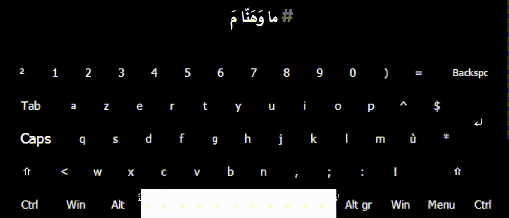
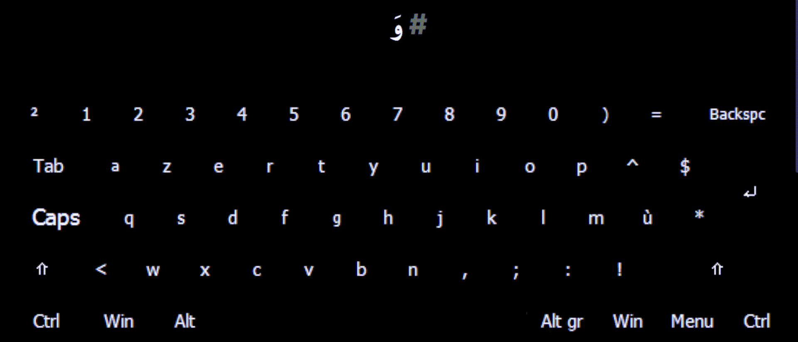

  <h1>Arabiyy - عَرَبِيّ</h1>

| **English**  | **العَرَبِيّة** |
|  :--- |  ---: |
| <h4>This tool is a virtual keyboard that allows our Muslim brothers and sisters to type any Arabic word with dynamic tashkeel, all of that from the comfort of the Latin keyboard already built into their devices and most of the world's devices.</h4>  | <h3>هَذِهِ الأداةُ هِيَ لَوحةُ مَفاتيحٍ إفتِراضِيّةٍ تُتيحُ لِإخوانِنا مِنَ المُسلِمينَ والمُسلِماتِ كِتابةَ أيِّ كَلِمةٍ عَرَبِيّةٍ مَعَ تَشكيلِها ديناميكِيًّا، وَهَذا مِن راحةِ لَوحةِ المَفاتيحِ اللاتينِيّةِ المُدمَجةِ أصلًا في حَواسيبِهِم وَمُعظَمِ حَواسيبِ العالَم‏.‏</h3> |

  <h2><a href="source/Docs/README-en.md">Continue reading in English</a> - <a href="source/Docs/README-ar.md">أكمِل القِراءةَ بِالعَرَبِيّةِ الفُصحى</a></h2>

  <h3><a href="source/Docs/Docs-en.md">Read the Usage Guide</a> - <a href="source/Docs/Docs-ar.md">إقرَأ دَليلَ الإستِخدام</a></h3>

  <h2>Arabiyy in action - عَرَبِيّ قَيدَ الإستِخدام</h2>

#### ‎"‎قُم" Preview

  

#### ‎"‎وَديني دينُ عِزّ" Preview

  

