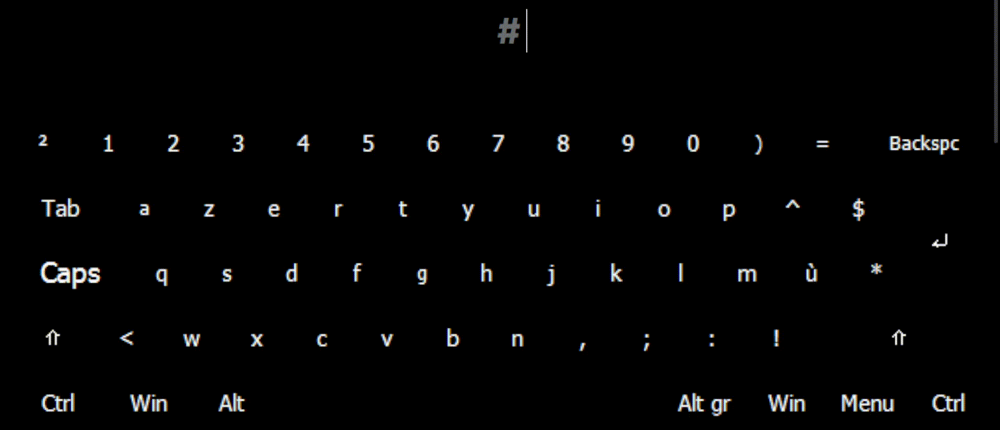

# لَوحةُ مَفاتيحِ عَرَبِيّ  
  
هَذِهِ الأداةُ هِيَ لَوحةُ مَفاتيحٍ إفتِراضِيّةٍ تُتيحُ لِإخوانِنا مِنَ المُسلِمينَ والمُسلِماتِ كِتابةَ أيِّ كَلِمةٍ عَرَبِيّةٍ مَعَ تَشكيلِها ديناميكِيًّا مِن راحةِ لَوحةِ المَفاتيحِ اللاتينِيّةِ المُدمَجةِ أصلًا في حَواسيبِهِم وَمُعظَمِ حَواسيبِ العالَم.

## فَهرَسُ المُحتَوَيات  
- [المُقَدِّمة](#introduction)  
  - [الدَّوافِعُ والأسباب](#motivations-and-reasons)  
- [الأنظِمةُ المَدعومة](#supported-platforms)  
- [التَّحميل/التَّثبيت](#download-install)  
- [طَريقةُ الإستِخدام](#usage)  
- [التَّطوير](#development)  
  - [التَّحسينات](#improvements)  
  - [حُقوقُ المِلكِيّة](#copyright)  
  - [مَن يَستَفيدُ مِن هَذِهِ الأداة؟](#this-tool-will-help)  
    - [رَوابِطُ مُفيدة](#useful-links)  
- [أعجَبَكَ المَشروع؟](#like-the-project)  

## الدَّوافِعُ والأسباب
تَمَّ إنشاءُ لَوحةِ مَفاتيحِ عَرَبِيّ لِتَسهيلِ كِتابةِ النُّصوصِ العَرَبِيّةِ مَعَ التَّشكيلِ الدّيناميكِيِّ بِاستِخدامِ لَوحةِ المَفاتيحِ اللّاتينِيّة. هَذا مُفيدٌ بِشَكلٍ خاصٍّ لِطُلّابِ العُلومِ الإسلامِيّة، وَصانِعي التَّرجَمةِ النَّصِّيّة، وَأيِّ شَخصٍ يَحتاجُ إلى كِتابةِ النُّصوصِ العَرَبِيّةِ بِدِقّةٍ وَكَفاءة.  

# الأنظِمةُ المَدعومة
- [x] Windows
- [x] macOS
- [x] Linux
- [ ] Web
- [ ] Android
- [ ] iOS

---
- دَعمُ الأنظِمةِ الأُخرى مِثلَ الويب وَأندرويد وَiOS مُخَطَّطٌ لَهُ في المُستَقبَل، إن شاءَ اللَّه.
- تَمَّت تَجرِبةُ الأداةِ فَقَط عَلى نِظامِ وِندوز، وَلَكِن لا يُتَوَقَّعُ وُجودُ مُشكِلاتٍ مَعَ الأنظِمةِ الأُخرى.

# التَّحميل/التَّثبيت
لِلحُصولِ عَلى لَوحةِ مَفاتيحِ `عَرَبِيّ` عَلى جِهازِك، قُم بِما يَلي:  
1. ‏**قُم بِتَثبيتِ تَطبيقِ Keyman**:
  - ‏قُم بِتَحميلِ وَتَثبيتِ تَطبيقِ Keyman لِجِهازِكَ/نِظامِكَ مِن [هُنا](https://keyman.com/downloads/) (https://keyman.com/downloads/).

> [!IMPORTANT]
> ‏عَلى الحاسوب، تَأكَّد مِنَ الذَّهابِ إلى ‎`الإعدادات ‏(Keyman configuration) > الخَيارات (options)`‎، ثُمَّ انتَقِل لِلأسفَلِ واضغَط عَلى ‎`الكيبورد الأساسِيّ ‏(Base keyboard)`‎ واختَر لَوحةَ المَفاتيحِ الَّتي تَتَوافَقُ مَعَ جِهازِك.

2. ‏**تَحميلُ لَوحةِ المَفاتيح**:
  - ‏إذهَب إلى [الإصدارات](https://github.com/O1Anas/Arabiyy-keyboard/releases) وَقُم بِتَحميلِ أحَدَثِ إصدار.
  - ‏تَأكَّد مِن اختيارِ النُّسخةِ المُناسِبةِ لِمَواصَفاتِ جِهازِكَ كَما هوَ مُوَضَّحٌ في هَذا الجَدوَل:

| ‏الوَصف | ‏نَوعُ لَوحةِ المَفاتيح |
|--:|--:|
| ‏(`shift` بِدونِ الحاجةِ إلى) ‏النُّسخةُ لِلَوحاتِ المَفاتيحِ بِالأرقامِ في المُستَوى الأوَّل<li dir="rtl">‏تَعمَلُ جَيِّدًا مَعَ لَوحاتِ مَفاتيحِ ‏`‏US/UK QWERTY`، ‏`‏QWERTZ`، ‏`‏DVORAK`، ‏`‏COLEMAK` وَ`‏French-Belgian (‏AZERTY إستِثنائِيّة)`</li>‏ | `Arabiyy.kmx` |
| ‏(`shift` تَحتاجُ إلى) ‏النُّسخةُ لِلَوحاتِ المَفاتيحِ بالأرقامِ في المُستَوى الثّاني<li dir="rtl">تَعمَلُ جَيِّدًا مَعَ ‏`‏AZERTY ‏(‏المُعتَمد فِرَنسِيًّا)`، ‏`‏French DVORAK (BÉPO)` وَلَوحاتِ المَفاتيحِ العَرَبِيّة، الفارِسِيّة، اليابانِيّةِ والكَنَدِيّة</li>‏ | `ArabiyyNumOnShift.kmx` | 
| النُّسخةُ الخاصّةُ بِأندرويد (قَريبًا) | `Arabiyy`**`.kmp`** | 
- عَلى سَبيلِ المِثال، إذا كانَت لَوحةُ مَفاتيحِ جِهازِكَ تَكتُبُ الأرقامَ بِاستِخدامِ `shift`، قُم بِتَحميلِ نُسخةِ `NumOnShift`.
- إذا لَم تَكُن كَذَلِك، فَقُم بِتَحميلِ النُّسخةِ العادِيّة (تَكتُبُ الأرقامَ بِدونِ الحاجةِ إلى `shift`).

# طَريقةُ الإستِخدام
تَمَّت كِتابةُ دَليلٍ مُفَصَّلٍ عَن كَيفِيّةِ استِخدامِ هَذِهِ الأداة [هُنا، في مِلَفِّ الوَثائِق.](Docs-ar.md)

<h2><a href="Docs-ar.md">------- دَليلُ الإستِخدام -------</a></h2>

# التَّطوير  
لِلمُساهَمةِ في تَطويرِ هَذِهِ الأداة:
1. ‏[قُم بِتَثبيتِ Keyman Developer مِن هُنا](https://keyman.com/developer/download).
2. ‏قُم بِاستِنساخِ/تَحميلِ هَذا المُستَودَعِ مِن GitHub إلى جِهازِك.
3. ‏ساهِم في البَرمَجةِ داخِلَ المَشروعِ أو تَوثيقِه 💙

## التَّحسينات
- ‏إنشاءُ نُسخةٍ تَضيفُ قَواعِدَ التَّجويدِ إلى النَّصِّ المَكتوب؟
  - ‏نَعَم، هَذا مُمكِنٌ وَمُفيدٌ لِطُلّابِ القُرآنِ والتَّجويد.
- ‏تَطويرُ أداةٍ تُطَبِّقُ أُسلوبَ تَشكيلِ عَرَبِيّ عَلى النَّصِّ العَرَبِيِّ المُقَدَّم؟
- ‏إنشاءُ جَدوَلٍ يَحتَوي عَلى جَميعِ الأحرُفِ العَرَبِيّةِ وَكُلِّ طَريقةٍ لِكِتابَتِها؟

## حُقوقُ المِلكِيّة
راجِع [الرُّخصةَ هُنا](LICENSE-ar.md).

## مَن يَستَفيدُ مِن هَذِهِ الأداة؟
- ‏طُلّابُ العِلمِ النّافِع
  - ‏خُصوصًا طُلّابُ العُلومِ الإسلامِيّة ❤️
- ‏المُتَرجِمونَ/النّاسِخون
- ‏مُحِبّو اللُّغةِ العَرَبِيّة
  - ‏أيُّ شَخصٍ يَهدِفُ إلى تَحسينِ طَلاقَتِهِ في الكِتابةِ بِالعَرَبِيّة
- ‏الطُّلّابُ والباحِثونَ العامِلونَ بِاللُّغةِ العَرَبِيّة
- ‏المُطَوِّرونَ والمُبَرمِجونَ الَّذينَ يَحتاجونَ إلى لَوحةِ مَفاتيحٍ عَرَبِيّةٍ فَعّالة
- ‏المُعَلِّمونَ الَّذينَ يُنشِئونَ مَوادَّ تَعليمِيّةً بِاللُّغةِ العَرَبِيّة
- ‏الخَطّاطونَ والمُصَمِّمونَ الَّذينَ يَصنَعونَ أعمالًا/مَحتوَياتٍ نَصِّيّةً بِالعَرَبِيّة

> [!CAUTION]  
> **تَأكَّد مِن عَدَمِ استِخدامِ الأداةِ في أُمورٍ مُحَرَّمةٍ شَرعًا.**

### رَوابِطُ مُفيدة
- [مِشكال](https://github.com/linuxscout/mishkal)، قُم بِتَحميلِه [مِن هُنا](https://sourceforge.net/projects/mishkal/files/).
- [أداةُ تَشكيلٍ بِالذَّكاءِ الاصطِناعِيّ](https://www.tashkil.net/tashkil).
- [قُطرُب](https://github.com/linuxscout/qutrub)، مُتاحٌ لِأندرويد، لينُكسَ وَوِندوز [مِن هُنا](https://qutrub.arabeyes.org/download/).

# أعجَبَكَ المَشروع؟
إذا أعجَبَكَ هَذا المَشروعُ وَتَرغَبُ في دَعمِهِ وَمُنشِئَهُ مادِّيًّا:

